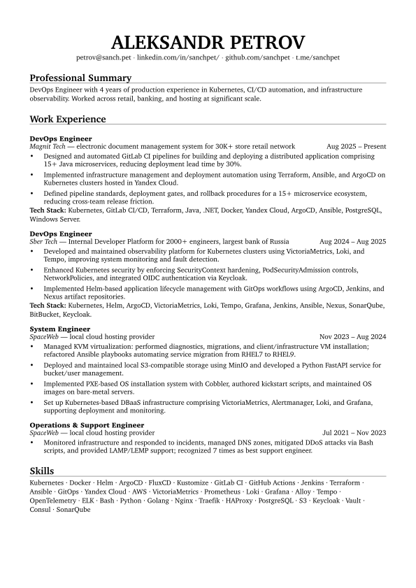
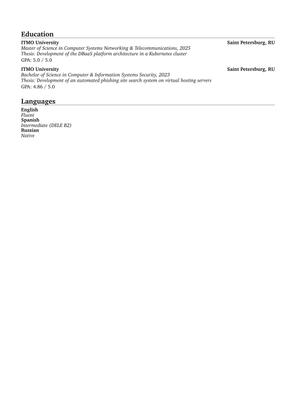

# CV — Typst source

Resume of Aleksandr Petrov, written in [Typst](https://typst.app).

SVG previews below are auto-generated by GitHub Actions on every change to `Curriculum_Vitae.typ`.




---

## Local setup

Install Typst:

```bash
brew install typst
```

Compile to PDF:

```bash
typst compile Curriculum_Vitae.typ
```

Watch mode (auto-recompile on save):

```bash
typst watch Curriculum_Vitae.typ
```
